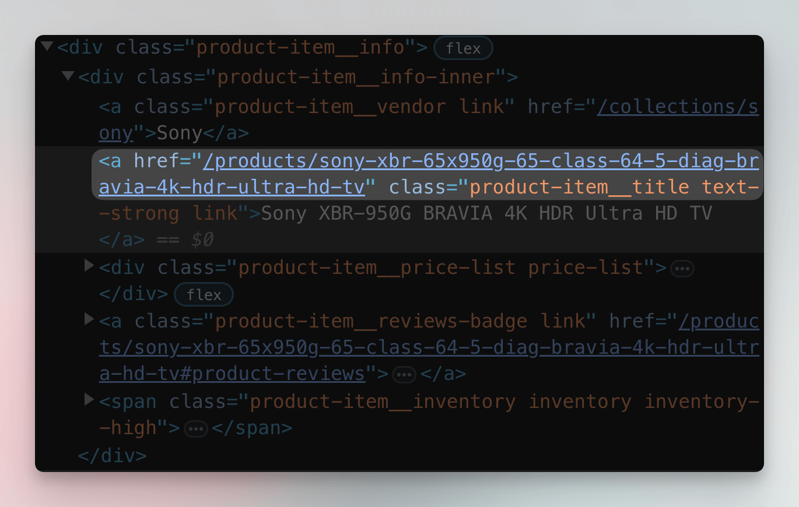
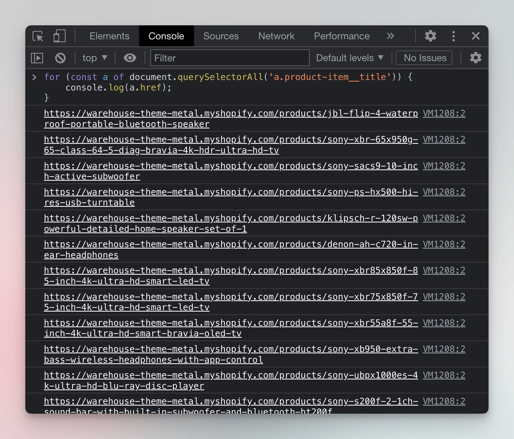

import Tabs from '@theme/Tabs';
import TabItem from '@theme/TabItem';

# Filtering links {#filtering-links}

**When you extract links from a web page, you often end up with a lot of irrelevant URLs. Learn how to filter the links to only keep the ones you need.**

---

Web pages are full of links, but frankly, most of them are useless to us when scraping. Filtering links can be approached in two ways: Targeting the links we're interested in by using unique CSS selectors, or extracting all links and then using pattern matching to find the sought after URLs. In real scraping scenarios, both of these two approaches are often combined for the most effective URL filtering.

## Filtering with unique CSS selectors {#css-filtering}

In the previous lesson, we grabbed all the links from the HTML document.

<Tabs groupId="main">
<TabItem value="DevTools" label="DevTools">

```js
document.querySelectorAll('a');
```

</TabItem>
<TabItem value="Node.js with Cheerio" label="Node.js with Cheerio">

```js
$('a');
```

</TabItem>
</Tabs>

### Attribute selector {#attribute-selector}

That's not the only way to do it, however. Since we're interested in the `href` attributes, a first very reasonable filter is to exclusively target the `<a>` tags that have the `href` attribute (yes, anchor tags without the attribute can and do exist). You can do that by using the [CSS attribute selector](https://developer.mozilla.org/en-US/docs/Web/CSS/Attribute_selectors).

<Tabs groupId="main">
<TabItem value="DevTools" label="DevTools">

```js
document.querySelectorAll('a[href]');
```

</TabItem>
<TabItem value="Node.js" label="Node.js">

```js
$('a[href]');
```

</TabItem>
</Tabs>

Adding the `[href]` part of the selector will save you from nasty bug hunts on certain pages.

### Link specific selectors {#specific-selectors}

Let's go back to the [Sales category of Warehouse](https://warehouse-theme-metal.myshopify.com/collections/sales) and see how we could capture only the links to product detail pages. After inspecting the product cards in DevTools, you'll find that the links are available together with the product's title. Getting them will therefore be very similar to getting the product titles in the previous section.



<Tabs groupId="main">
<TabItem value="DevTools" label="DevTools">

```js
document.querySelectorAll('a.product-item__title');
```

</TabItem>
<TabItem value="Node.js" label="Node.js">

```js
$('a.product-item__title');
```

</TabItem>
</Tabs>


When we print all the URLs in the DevTools console, we can see that we've correctly filtered only the product detail page URLs.

```js title=DevTools
for (const a of document.querySelectorAll('a.product-item__title')) {
    console.log(a.href);
}
```

:::info

If you try this in Node.js instead of DevTools, you will not get the full URLs, but only so-called **relative links**. We will explain what those are and how to work with them in the next lesson.

:::




## Filtering with pattern-matching {#pattern-matching-filter}

Another common way to filter links (or any text, really) is by matching patterns with regular expressions.

> [Learn more about regular expressions](https://developer.mozilla.org/en-US/docs/Web/JavaScript/Guide/Regular_Expressions)

When we inspect the product URLs, we'll find that they all look like the following:

```text
https://warehouse-theme-metal.myshopify.com/products/denon-ah-c720-in-ear-headphones
https://warehouse-theme-metal.myshopify.com/products/sony-sacs9-10-inch-active-subwoofer
https://warehouse-theme-metal.myshopify.com/products/sony-ps-hx500-hi-res-usb-turntable
```

That is, they all begin with exactly the same pattern and only differ in the last portion of the path. We could write the pattern like this:

```text
https://warehouse-theme-metal.myshopify.com/products/{PRODUCT_NAME}
```

This means that we can create a regular expression that matches those URLs. You can do it in many ways . For simplicity, let's go with this one:

```RegExp
https?:\/\/warehouse-theme-metal\.myshopify\.com\/products\/[\w\-]+
```

This regular expression matches all URLs that use either `http` or `https` protocol and point to `warehouse-theme-metal.myshopify.com/products/` immediately followed with any number of letters or dashes `-`.

> A great way to learn more about regular expression syntax and to test your expressions are tools like [regex101.com](https://regex101.com/) or [regexr.com](https://regexr.com/). It's okay if you don't get the hang of it right away!

To test our regular expression in the DevTools console, we'll first create a [`RegExp`](https://developer.mozilla.org/en-US/docs/Web/JavaScript/Reference/Global_Objects/RegExp) object and then test the URLs with the [`regExp.test(string)`](https://developer.mozilla.org/en-US/docs/Web/JavaScript/Reference/Global_Objects/RegExp/test) function.

```js
// To demonstrate pattern matching, we use only the 'a'
// selector to select all links on the page.
for (const a of document.querySelectorAll('a')) {
    const regExp = /https?:\/\/warehouse-theme-metal\.myshopify\.com\/products\/[\w-]+/;
    const url = a.href;
    if (regExp.test(url)) console.log(url);
}
```

When you run this code in DevTools Console on the [Sales category of Warehouse](https://warehouse-theme-metal.myshopify.com/collections/sales), you'll see that it produces a slightly different set of URLs than the CSS filter did.


That's because we selected all the links on the page and apparently there are more ways to get to the product detail pages. After careful inspection we can find that we can get there not only by clicking the title, but also by clicking the product's image, which leads to duplicates. Some products also have review links that lead to a specific subsection of the product detail page.

With that said, yes, filtering with CSS selectors is often the better and more reliable option. But sometimes, it's not enough, and knowing about pattern matching with regular expressions expands your scraping toolbox and helps you tackle more complex scenarios.

## Next Up {#next}

In the [next lesson](./15_relative_urls.md) we'll see how rewriting this code to Node.js is not so simple and learn about absolute and relative URLs in the process.
