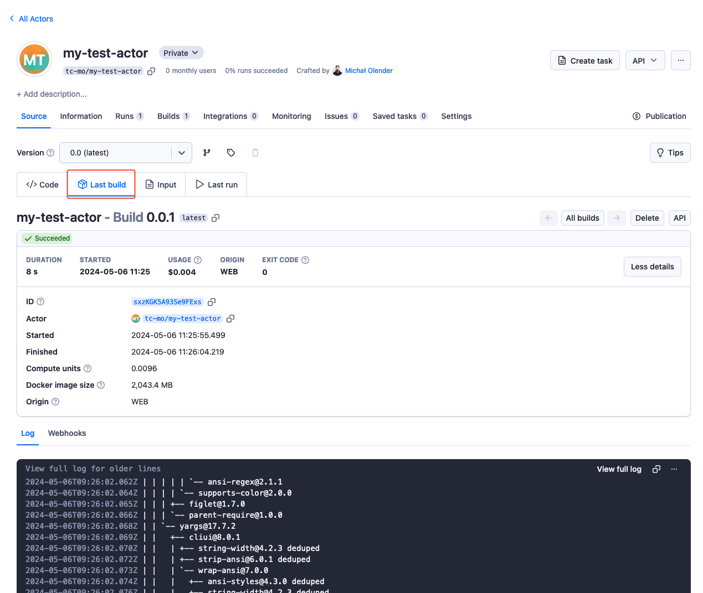
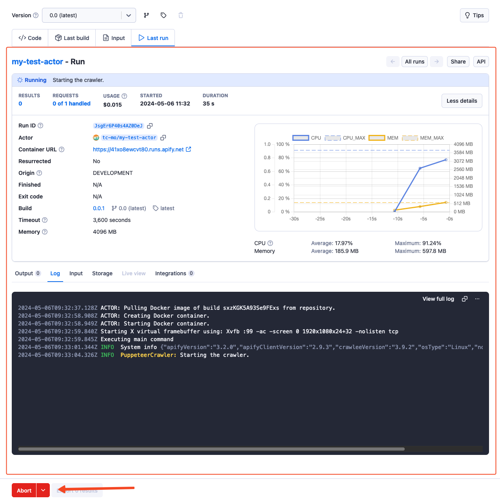

import Tabs from '@theme/Tabs';
import TabItem from '@theme/TabItem';

**Create your first Actor using the web IDE in Apify Console.**

---

:::note Prerequisites

To use Web IDE, you need an Apify account. You can [sign-up for a free account](https://console.apify.com/sign-up) on the Apify website.

:::

## Create the Actor

1. After you sign in to [Apify Console](https://console.apify.com), navigate to **Development** section.
1. Click the **Develop new** button at the top right corner.
    <!-- TODO:change this screenshot to show `Start with JavaScript` template -->
    

    You'll see options to create an Actor from existing source code or from a template. For this quick start, we'll use a template.

1. You'll be redirected to a page with various Actor templates for JavaScript, TypeScript, and Python. These templates provide boilerplate code and a preconfigured environment.

    You can select one from the list or browse all templates in the template library by clicking **View all templates**.
    For this guide, let's choose the **Start with JavaScript** template.

    

1. Click the **Use this template** button. This creates the Actor in Apify Console and takes you to the **Code** tab with Web IDE open, showing the template's code.
<!-- TODO:change this screenshot to show `Start with JavaScript` template -->


### Explore the source code


The **Start with JavaScript** template is a great starting point for web scraping, designed to extract data from a single website. It uses [Axios](https://axios-http.com/docs/intro) for downloading page content and [Cheerio](https://cheerio.js.org/) for parsing HTML.

The main logic resides in the `src/main.js` file:

```js
// Axios - Promise based HTTP client for the browser and node.js.
import { Actor } from 'apify';
import axios from 'axios';
// Cheerio - Fast, flexible & elegant library for parsing and manipulating HTML and XML.
import * as cheerio from 'cheerio';
// Apify SDK - Toolkit for building Apify Actors.

// Initialize the Actor. It's recommended to start every Actor with init().
await Actor.init();

// Get the input, whose structure is defined in input_schema.json.
const input = await Actor.getInput();
const { url } = input;

// Fetch the HTML content of the page.
const response = await axios.get(url);

// Parse the downloaded HTML with Cheerio to enable data extraction.
const $ = cheerio.load(response.data);

// Extract all headings (h1-h6) from the page.
const headings = [];
$('h1, h2, h3, h4, h5, h6').each((i, element) => {
    const headingObject = {
        level: $(element).prop('tagName').toLowerCase(),
        text: $(element).text(),
    };
    console.log('Extracted heading', headingObject);
    headings.push(headingObject);
});

// Save headings to the Dataset.
await Actor.pushData(headings);

// Gracefully exit the Actor process.
await Actor.exit();
```

This Actor takes a `url` from its input and then:

1. Sends a request to the URL
1. Downloads the page's HTML content.
1. Extracts all headings (H1-H6) from the page.
1. Stores the extracted headings in the [Dataset](/platform/storage/datesets).


Feel free to modify the code. For example, try extracting links or images. If you change the input requirements, remember to update the [input schema](/platform/actors/development/input-and-output#input-schema) in `.actor/input_schema.json`

:::info Crawlee
For more advanced scraping tasks, consider using [Crawlee](https://crawlee.dev/), Apify's open-source Node.js library for web scraping and browser automation. Many templates, like "Crawlee + Puppeteer + Chrome," use Crawlee.
:::

### Build the Actor

To run your Actor, you need to build it first. The build process packages your Actor's source code into a runnable image.

Click the **Build** button below the source code to start the build process.

The UI will switch to the **Last build** tab, displaying the build progress and the logs. The build typically takes 5-10 seconds. It's finished when you see **Start** button.



:::note Actor development flow

The UI includes several tabs: **Code**, **Last build**, **Input**, and **Last Run**. This represent the typical Actor development flow: write code, build it, provide input, and then run it.

:::

### Provide the input

Before running the Actor, let's provide its input. Go to the **Input** tab.
For the **Start with Javascript** template, the input is a URL to scrape. By default, it's prefilled with `https://apify.com/`. You can change this to any website you want to extract headings from.


Below the input fields, you can also adjust **Run options** like the build version to use, timeout, and memory limit.

### Run the Actor

Once you've set up the input URL, click the **Start** button.

The Actor will begin its run. You can monitor its progress and view logs in real-time in the **Last run** tab (or the run's dedicated page).



After the Actor finishes, its status will change (e.g., to **Succeeded**). You can then view or download the extracted data from the Dataset. To do so, click the **Export X results** (where **X** is the number of results) button in the **Output** or **Dataset** tab of the run.

You've created, built, and run your first Actor, extracting data from a website.

## Iterate  and customize

You can continue to modify your Actor's code in the Web IDE. After making changes, remember to **Build** it again before running.

### Pull the Actor to local machine

You can pull the Actor's source code to your local machine to use your preferred editor and tools.

:::note Prerequisites for local developments

Install `apify-cli`:

<Tabs>
    <TabItem value="macOS/Linux" label="macOS/Linux">
    ```bash
    brew install apify-cli
    ```
    </TabItem>
    <TabItem value="other platforms" label="Other platforms">
    ```bash
    npm -g install apify-cli
    ```
    </TabItem>
</Tabs>
:::

To pull your Actor:

1. Log in to Apify with the CLI

    ```bash
    apify login
    ```

    You'll be prompted for your API token (you can find it in **[Consol > Settings > Integrations](https://console.apify.com/settings/integrations)**)

1. Pull the Actor:

    ```bash
    apify pull YOUR-ACTOR-NAME
    ```

    Replace `YOUR-ACTOR-NAME` with the Actor's unique name (e.g., `username/my-actor`) or its ID (e.g., `E2jjCZBezvAZnX8Rb`). You can find these by clicking the Actor's title in Console.
    To pull specific version you can use:

    ```bash
    apify pull YOUR-ACTOR-NAME --version [version_number]
    ```

### Push changes changes from local machine

After modifying the code locally, you can push it back to the Apify platform:

```bash
apify push
```

This uploads your local changes, and you'll need to build the Actor in Console again to use the new version.
