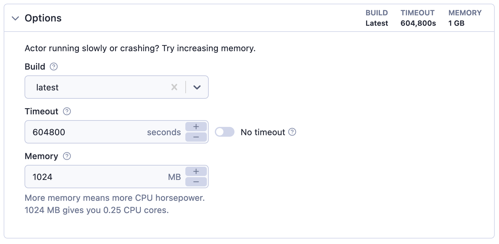

**Configure your Actor's input parameters using Apify Console, locally or via API. Access parameters from your Actor's code and store its results.**

---

Actors like other programs, typically process inputs to generate outputs. The Apify platform provides mechanisms to specify expected inputs for an Actor and to store its results, either temporarily or permanently.

## Input

Each Actor can accepts input, which directs its operation. You can provide input to an Actor in several ways:

### Configure input via Apify Console

When running an Actor using the [Apify Console](https://console.apify.com/) UI, you can configure its input parameters.


If an input schema is defined for the Actor, the Console generates a user-friendly interface for these parameters.

#### Define an input schema

While an Actor can accept any JSON input without a predefined schema, providing an `INPUT_SCHEMA.json` file offers significant benefits:

- _UI Generation_: The Apify platform uses the schema to generate a clear user interface in the Console for Actor configuration.
- _Input Validations_: The schema enables automatic validation of input values, ensuring the Actor receives data in the expected format.

Here is an example of an `INPUT_SCHEMA.json` for an Actor that adds two numbers:

```json
{
    "title": "Number Adder Input",
    "type": "object",
    "schemaVersion": 1,
    "properties": {
        "num1": {
            "title": "First Number",
            "type": "integer",
            "description": "The first number to add.",
            "editor": "number"
        },
        "num2": {
            "title": "Second Number",
            "type": "integer",
            "description": "The second number to add.",
            "editor": "number"
        }
    },
    "required": ["num1", "num2"]
}
```

For more details on creating input schemas, refer to the [input schema specification](/platform/actors/development/actor-definition/input-schema/specification/v1).

### Provide input via API or JSON

When running an Actor using the Apify API, you pass the input as a JSON object. To create input UI as shown on the previous screenshot it would be:

```json
{
    "maxRequestsPerCrawl": 10,
    "proxy": {
        "useApifyProxy": true
    },
    "startUrl": "https://apify.com"
}
```

### Access input in Actor code

Within your Actor's code (e.g., in `main.js` for JavaScript Actors), you can access the provided input using the Apify SDK. For example, to retrieve the input in a JavaScript Actor:

```js
import { Actor } from 'apify';

await Actor.init();

// Retrieve the Actor's input
const input = await Actor.getInput();

// Example: Accessing specific input fields
const firstNumber = input.num1;
const secondNumber = input.num2;

// Your Actor logic here...
// e.g., const solution = firstNumber + secondNumber;

await Actor.exit();
```

Learn more about [accessing user input](/sdk/js/docs/examples/accept-user-input).

### Run options - Build, Timeout, and Memory

In addition to task-specific parameters, you can specify run options such as [Build](../development/builds_and_runs/builds.md), Timeout, and [Memory](./usage_and_resources.md) for your Actor run.

There are typically configured alongside the main input:



| Option | Description |
|:---|:---|
| Build | Tag or number of the build to run (e.g. **latest** or **1.2.34**). |
| Timeout | Timeout for the Actor run in seconds. Zero value means there is no timeout. |
| Memory | Amount of memory allocated for the Actor run, in megabytes. |

Refer to [Builds](platform/development/builds_and_runs/builds) and [Usage and Resources](platform/usage_and_resources.md) for more details on these options.

## Output

Actors generate output as a result of their processing. This output is typically stored in the Actor's default [Dataset](platform/storage/dataset), through other files or metadata might be saved in its default [Key-value stor](platform/storage/key-value-store).

Always consult an Actor's README file (if available) to understand its specific output format and storage locations.

### Store output from Actor code

The Apify SDK provides methods to store data. A common way to save structured results is by pushing data to the Actor's default dataset:

```js
import { Actor } from 'apify';

await Actor.init();

const input = await Actor.getInput();
const solution = input.num1 + input.num2;

// Push the result to the default dataset
await Actor.pushData({ result: solution, input1: input.num1, input2: input.num2 });

await Actor.exit();
```

This code snippet demonstrates an Actor that takes two numbers, adds them ,a nd stores the result along with the original numbers. For more examples, see [Adding data to a dataset](/sdk/js/docs/examples/add-data-to-dataset).

#### Data retention

It's important to be aware of data retention policies. Data in an Actor's default dataset (and other default storages) is typically retained for a limited period (e.g., 7 days), depending on your subscription plan. For indefinite storage, you must use _named_ datasets or key-value stores. For more information, review the [data retention policies](platform/storage/usage#data-retention).

#### Accessing output

You can access an Actor's output in several ways:

##### Via Apify Console

The run detail page in Apify Console provides quick access to the Actor's output. The **Results** tab (or similar, previously sometimes shown as a direct output box) allows you to preview and download data from the default dataset.

<!-- TODO screenshot -->

To explore all data associated with a run, including the default Dataset, Key-value store, and Request queue, navigate to the **Storage** tab for that specific run:

<!-- TODO screenshot -->

From here, you cae view,preview, and download data in various formats (JSON, CSV, Excel, etc.).

##### Via API

You can also retrieve Actor output programmatically using the [Apify API](/api/v2). This is useful for integrating Actor results into other applications or workflows.
